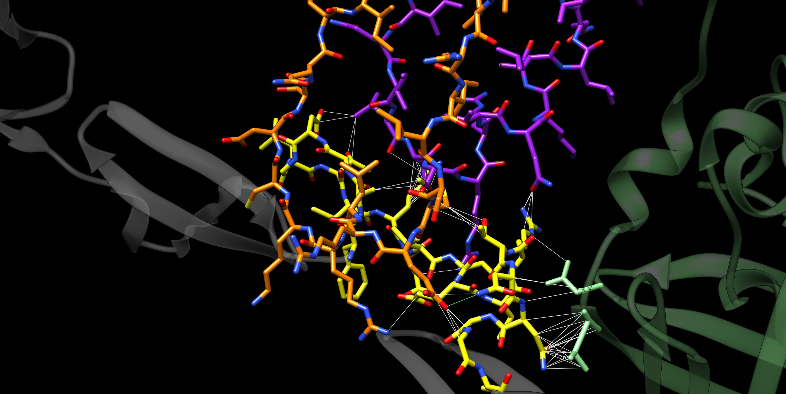
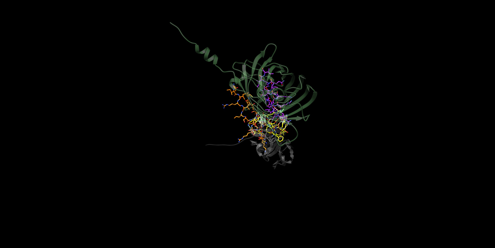
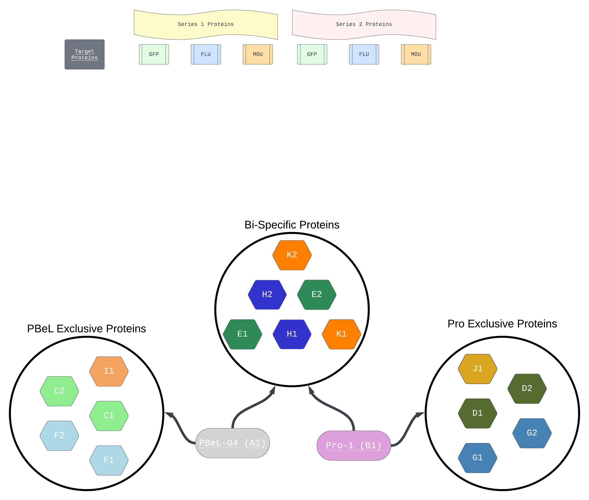

<!DOCTYPE html>
<html>
<head>

</head>
<body>

<!-- Thumbnail 1 -->

  

<!-- Thumbnail 2 -->

  

<!-- Larger Image Container -->

  

<!-- JavaScript Function to Run Shiny App -->

</body>
</html>

